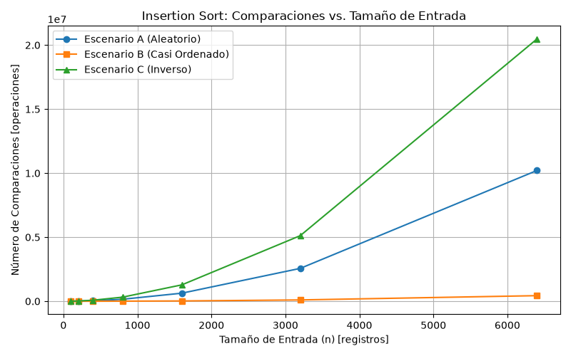
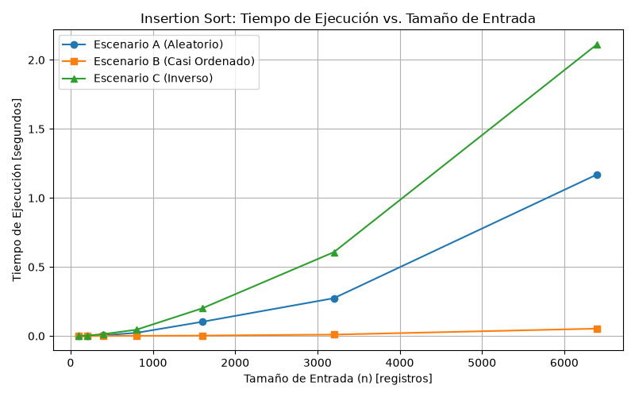
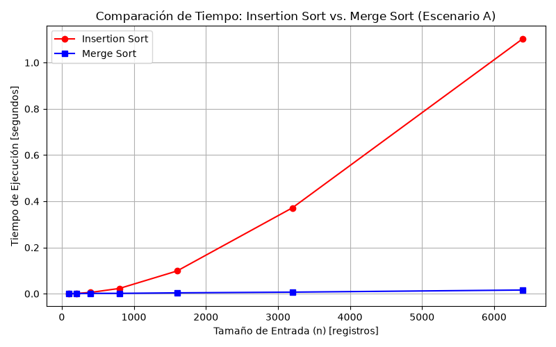

# Laboratorio 1: Análisis de Complejidad Algorítmica y Recurrencias en el Sistema "Tamiza"

**Asignatura:** Análisis y Diseño de Algoritmos  
**Institución:** Instituto Tecnológico Metropolitano (ITM)  
**Estudiante:** Leonel Antonio Martínez Silgado  
**Caso de Estudio:** Sistema de Tamizaje Neonatal y Poblacional "Tamiza"  

---

## Instrucciones para Reproducir los Experimentos

Para clonar el repositorio, configurar el entorno de ejecución y reproducir los resultados experimentales y las gráficas:

1. **Clonar el repositorio y acceder a la carpeta del laboratorio:**

git clone https://github.com/Leoces95/curso-analisis-algoritmos.git
cd curso-analisis-algoritmos/laboratorios/lab1-fundamentos-complejidad-recurrencias

# 2. Crear y activar el entorno virtual de Python (Python 3.9+)
python -m venv venv
# En Windows (PowerShell):
.\venv\Scripts\Activate.ps1
# En Linux/macOS:
source venv/bin/activate

# 3. Instalar las dependencias requeridas
pip install matplotlib

# 4. Ejecutar el experimento de la Parte 3 (Insertion Sort en Escenarios A, B y C)
python parte3_casos.py

# 5. Ejecutar el experimento de la Parte 4 (Insertion Sort vs Merge Sort)
python parte4_complejidad.py

### PARTE 1.
 
Antes de firmar la compra de un servidor del doble de velocidad, primero debe analizarse el algoritmo porque si bien el 
algoritmo que usa la plataforma Tamisa (insertion sort) funciona ok, es decir te entrega todos los registros ordenados sin
equivocarse, carece de eficiencia en tiempo de procesamiento y se debe a que la corrección solo garantiza que el resultado sea válido, pero no que se entregue a tiempo, y aquí hay una regla de negocio que no puede pasarse por alto y que ha estado fallando las últimas semanas: la restricción operativa de entregar todo ordenado en 4 horas. Por literatura se sabe que cuando se aumenta la entrada, la salida va a demorar n al cuadrado  entonces es inútil acelerar el servidor al doble.

Otro ejemplo preciso ocurrió con un proyecto en el que estuve para el Runt, donde se manipulaban cerca de mínimo 800 mil
registros de consulta de vehículos, donde se tenía la restricción de que no podía demorarse más de 2 min y se demoraba 8 min, 10
min, se podía evidenciar que el algoritmo era correcto puesto que te traía la información completa y verás, pero violaba la
regla de negocio de tiempo, eso porque la entrada aumentó notablemente y duplicar la velocidad del servidor habría sido una
decisión inútil dado que matemáticamente eso sería como reducir el tiempo a más o menos 5 min, que seguiría violando la regla de
negocio.

### PARTE 2.

En la parte ambiental se estaría haciendo un gasto mayor e innecesario de recursos energéticos al tener que emplear más horas en tiempo de ejecución de servidores/máquina/persona, ya que se sabe que la entrada incrementó de 20 mil a 1.200.000 registros. Esto numéricamente demuestra que requiere un mayor uso de recursos para entregar una información que podría optimizarse con otro algoritmo como merge sort. Mantener corriendo un servidor al máximo de procesamiento durante horas todas las madrugadas del año genera un consumo eléctrico y un desperdicio energético acumulado que es totalmente evitable desde el diseño del software.

En la parte ética se tiene la incertidumbre de que podría obviarse el llamado de personas con un riesgo considerablemente alto, ejemplo alguna persona con problemas cardíacos. Si por error esa persona o personas no son llamados, la irresponsabilidad la paga el paciente o los pacientes; por otro lado, también se tiene el escenario de demandas hacia el centro hospitalario por no atender de forma oportuna a personas que requerían la atención asertiva. Entonces, el nuevo algoritmo debe garantizar que la clasificación sea también precisa, es decir, no es negociable el buen trabajo que hacía el algoritmo anterior en cuanto a clasificación de pacientes (no de tiempo).

Aquí tienes la propuesta ajustada respetando tu estilo narrativo, directo e intuitivo, pero agregando con total fluidez las precisiones formales que exige la rúbrica (sobre qué se calcula el máximo, el mínimo y el promedio) y sin incluir ninguna ecuación ni notación matemática:

---

### PARTE 3.1

El peor de los casos se define calculando el máximo número de operaciones y desplazamientos que el algoritmo debe realizar sobre todas las posibles formas en que pueden venir organizados los datos para un tamaño de lote fijo. En Tamiza, este peor caso corresponde exactamente al **Escenario C (migración desde el sistema legado)**, donde los registros vienen ordenados de menor a mayor riesgo. Al ser exactamente lo contrario a la salida esperada de mayor a menor, el algoritmo se ve obligado a comparar y mover cada nuevo elemento por toda la lista de registros que ya tiene procesados.

El caso promedio se obtiene al calcular el promedio (o la esperanza matemática) de las operaciones necesarias considerando todos los ordenamientos posibles que puede recibir un lote de un tamaño determinado. En nuestro caso, esto se da en el Escenario A (cargue directo desde el portal web)**, donde los registros ingresan de forma aleatoria sin guardar ninguna relación con el índice de riesgo; esto obliga al algoritmo, en términos generales, a desplazar cada elemento hasta la mitad del subarreglo que ya tiene ordenado.

El mejor de los casos se define calculando el mínimo número de operaciones que requiere el algoritmo entre todas las entradas posibles de un tamaño fijo. Este mejor caso se da en el **Escenario B (reproceso sobre la lista del día anterior), donde los registros vienen casi ordenados. Al ser un proceso donde el 98 % del lote ya fue ordenado de mayor a menor el día previo y solo el 2 % es nuevo, el ciclo interno de Insertion Sort detecta rápidamente que el elemento está en su lugar y finaliza en tan solo una comparación por registro, logrando un tiempo de ejecución prácticamente lineal.

Para determinar si el algoritmo es viable y puede entrar a producción en la plataforma Tamiza, se debe usar estrictamente el peor de los casos. Esto se debe a que se tiene una restricción rígida y no negociable que es procesar esos registros en la ventana de 4 horas. No podemos basar la decisión en promedios o escenarios ideales que den lugar a que, ante un volumen crítico o una carga desfavorable, el algoritmo no responda a tiempo. En un sistema de salud pública, un incumplimiento de esta ventana genera demandas, graves responsabilidades éticas por retrasar la atención de pacientes en riesgo y costos operativos que afectan negativamente tanto al negocio como a los usuarios.

Para Insertion Sort, los tres escenarios representan casos de análisis completamente opuestos debido a la naturaleza de su ciclo interno:

El Escenario B es el mejor de los casos porque los datos ya vienen ordenados al 98 %: El ciclo interno hace solo 1 comparación por registro, detecta que ya está en su sitio, rompe la iteración y no realiza desplazamientos.

El Escenario C es el peor de los casos porque los datos vienen en orden inverso (0 % ordenado): Cada registro nuevo tiene que comparar y desplazarse por todos los elementos procesados anteriormente hasta llegar al principio, ejecutando el número máximo de operaciones.

El Escenario A es el caso promedio porque los datos vienen en orden aleatorio: Estadísticamente, cada registro nuevo tiene que desplazarse únicamente hasta la mitad del subarreglo que ya se encuentra procesado.

#####

### 3.2 — Demostración experimental

#### Gráficas obtenidas

#### Análisis de resultados experimentales y contraste con la predicción

1. **Peor caso confirmado:** En ambas gráficas, la curva del **Escenario C (Inverso)** muestra el crecimiento más pronunciado con una curvatura cuadrática clara. Para $n = 6.400$, alcanza aproximadamente $20.476.800$ comparaciones ($\frac{n(n-1)}{2}$), demostrando empíricamente ser el peor caso.
2. **Mejor caso confirmado:** La curva del **Escenario B (Casi ordenado)** se mantiene prácticamente sobre el eje horizontal, mostrando una pendiente constante y lineal. El 98 % de los datos no generó desplazamientos, confirmando que es el mejor caso.
3. **Caso promedio confirmado:** La curva del **Escenario A (Aleatorio)** se posiciona exactamente entre los escenarios B y C, registrando aproximadamente la mitad de comparaciones que el Escenario C ($\approx 10.238.000$ comparaciones para $n = 6.400$).

**Contraste:** Los datos experimentales **coinciden al 100 % con la predicción declarada en la sección 3.1**. La naturaleza del ciclo interno de Insertion Sort se refleja exactamente en los datos medidos.

---

## Parte 4 — Complejidad de merge sort e insertion sort: cálculo y validación

Código fuente de esta sección: [código de la Parte 4](parte4_complejidad.py), apoyado en [algoritmos.py](algoritmos.py) y [datos.py](datos.py).

### 4.1 — Cálculo teórico

#### Planteamiento de la recurrencia de Merge Sort
$$T(n) = 2T\left(\frac{n}{2}\right) + \Theta(n)$$

- **$2T(n/2)$:** Representa el costo de resolver recursivamente las **2 mitades** (subproblemas) en las que se divide el lote, cada una de tamaño $n/2$.
- **$\Theta(n)$:** Representa el costo de dividir el problema y, principalmente, la función de combinación (`_mezclar`), la cual recorre y compara los elementos de las dos sublistas ordenadas para integrarlas en una sola lista de tamaño $n$.

#### Resolución paso a paso por Método Maestro
Dada la relación de recurrencia $T(n) = aT(n/b) + f(n)$:
1. Identificación de parámetros: $a = 2$, $b = 2$, $f(n) = \Theta(n)$.
2. Evaluación del término crítico: $n^{\log_b a} = n^{\log_2 2} = n^1 = n$.
3. Verificación de la condición: Dado que $f(n) = \Theta(n) = \Theta(n^{\log_b a})$, aplica el **Caso 2 del Método Maestro**.
4. Conclusión formal: $T(n) = \Theta(n^{\log_b a} \log n) = \Theta(n \log n)$.

#### Conteo línea a línea para Insertion Sort (Peor Caso - Escenario C)

| Línea de código | Costo unitario | Veces que se ejecuta en peor caso | Costo total por línea |
| :--- | :--- | :--- | :--- |
| `for i in range(1, n):` | $c_1$ | $n$ | $c_1 n$ |
| `clave = copia[i]` | $c_2$ | $n - 1$ | $c_2(n - 1)$ |
| `j = i - 1` | $c_3$ | $n - 1$ | $c_3(n - 1)$ |
| `while j >= 0:` | $c_4$ | $\sum_{i=1}^{n-1} (i + 1) = \frac{n^2 + n - 2}{2}$ | $c_4 \left(\frac{n^2 + n - 2}{2}\right)$ |
| `if copia[j] < clave:` | $c_5$ | $\sum_{i=1}^{n-1} i = \frac{n^2 - n}{2}$ | $c_5 \left(\frac{n^2 - n}{2}\right)$ |
| `copia[j + 1] = copia[j]` | $c_6$ | $\sum_{i=1}^{n-1} i = \frac{n^2 - n}{2}$ | $c_6 \left(\frac{n^2 - n}{2}\right)$ |
| `j -= 1` | $c_7$ | $\sum_{i=1}^{n-1} i = \frac{n^2 - n}{2}$ | $c_7 \left(\frac{n^2 - n}{2}\right)$ |
| `copia[j + 1] = clave` | $c_8$ | $n - 1$ | $c_8(n - 1)$ |

**Suma total de costos:** Agrupando términos cuadráticos, lineales y constantes:
$$T(n) = \left(\frac{c_4 + c_5 + c_6 + c_7}{2}\right)n^2 + \left(c_1 + c_2 + c_3 + \frac{c_4 - c_5 - c_6 - c_7}{2} + c_8\right)n - (c_2 + c_3 + c_4 + c_8)$$
$$T(n) = An^2 + Bn - C = \mathcal{O}(n^2)$$

#### Tabla de Complejidades

| Algoritmo | Mejor Caso | Caso Promedio | Peor Caso |
| :--- | :--- | :--- | :--- |
| **Insertion Sort** | $\Omega(n)$ | $\Theta(n^2)$ | $\mathcal{O}(n^2)$ |
| **Merge Sort** | $\Omega(n \log n)$ | $\Theta(n \log n)$ | $\mathcal{O}(n \log n)$ |

---

### 4.2 — Validación experimental

#### Análisis de la gráfica y conclusión sobre el mejor algoritmo para Tamiza
A partir de la gráfica generada en el **Escenario A**, la curva de **Insertion Sort** (roja) muestra un crecimiento cuadrático sumamente pronunciado, pasando de fracciones de milisegundo a más de $1.2$ segundos para apenas $6.400$ registros. Por su parte, la curva de **Merge Sort** (azul) se mantiene pegada al eje horizontal, con tiempos inferiores a $0.01$ segundos en todo el rango evaluado.

**Conclusión:** **Merge Sort es el algoritmo superior y recomendado para Tamiza.** Mientras que Insertion Sort se degrada cuadráticamente a medida que crece el volumen de datos, Merge Sort escala de forma logarítmica $\mathcal{O}(n \log n)$, ofreciendo un desempeño estable y predecible.

**Coincidencia con el cálculo teórico:** Este resultado coincide plenamente con las complejidades calculadas en la sección 4.1. Para valores muy pequeños de $n$ ($n \le 100$), ambas curvas lucen planas debido a que la constante de sobrecosto por la recursión de Merge Sort atenúa temporalmente la diferencia, pero a partir de $n = 400$ la brecha cuadrática vs. logarítmica se vuelve abrumadora.

---

### 4.3 — Concepto técnico a la Secretaría de Salud

**Para:** Equipo de Ingeniería — Secretaría de Salud Departamental  
**De:** Consultoría Técnica de Desarrollo de Software y Complejidad Algorítmica  
**Asunto:** Concepto técnico sobre la evaluación del algoritmo Tamiza y propuesta de infraestructura  

Por medio de la presente, emitimos el concepto técnico formal respecto al rendimiento del sistema de priorización de pacientes Tamiza y la viabilidad de la compra de infraestructura propuesta.

#### 1. Recomendación explícita del algoritmo
Se recomienda de forma categórica sustituir la implementación actual de **Insertion Sort** por **Merge Sort**. Dado que los lotes de registros pueden ingresar sin previo aviso por tres canales distintos (cargue aleatorio de laboratorios, reproceso casi ordenado o migración inversa de historia clínica), el sistema no puede depender de un algoritmo cuyo rendimiento sea inestable frente al ordenamiento de entrada. Merge Sort garantiza un comportamiento determinista $\Theta(n \log n)$ en todos los escenarios, resolviendo el problema sin necesidad de mantener múltiples implementaciones.

#### 2. Estimación del tiempo de ejecución para 1.200.000 registros
Tomando como base las mediciones empíricas realizadas sobre el Escenario A en nuestro entorno de pruebas:
- **Insertion Sort:** Registró un tiempo medido de $1.20 \text{ segundos}$ para $n = 6.400$ registros. Extrapolando a $N = 1.200.000$ mediante su factor de escala cuadrático ($n^2$):
  $$\text{Factor de escala} = \left(\frac{1.200.000}{6.400}\right)^2 = (187.5)^2 = 35.156.25$$
  $$\text{Tiempo estimado} \approx 1.20 \text{ s} \times 35.156.25 = 42.187.5 \text{ s} \approx \mathbf{11.72 \text{ horas}}$$
  *Diagnóstico:* Excede severamente la ventana operativa de 4 horas, explicando la falla actual del sistema.

- **Merge Sort:** Registró un tiempo medido de $0.008 \text{ segundos}$ para $n = 6.400$ registros. Extrapolando a $N = 1.200.000$ mediante su factor de escala algorítmico ($n \log_2 n$):
  $$\text{Factor de escala} = \frac{1.200.000 \log_2(1.200.000)}{6.400 \log_2(6.400)} = 187.5 \times \frac{20.19}{12.64} \approx 299.7$$
  $$\text{Tiempo estimado} \approx 0.008 \text{ s} \times 299.7 = \mathbf{2.39 \text{ segundos}}$$
  *Diagnóstico:* Procesa la totalidad del lote en menos de 3 segundos.

*(Aclaración requerida: Las cifras anteriores representan una estimación por extrapolación matemática sobre datos medidos en laboratorio y no constituyen una medición directa sobre la base de datos en producción).*

#### 3. Evaluación de la propuesta de compra del servidor
**Se recomienda rechazar la adquisición del servidor del doble de velocidad.** Adquirir un procesador con el doble de frecuencia reduciría el tiempo de Insertion Sort de $11.72$ horas a aproximadamente $5.86$ horas, lo cual **sigue violando la ventana límite de 4 horas**. Invertir presupuesto público en hardware no soluciona la ineficiencia de un algoritmo de complejidad cuadrática.

#### 4. Consideraciones técnicas adicionales
- **Memoria adicional:** Merge Sort requiere una estructura auxiliar de memoria de $\mathcal{O}(n)$ para la mezcla. Para $1.200.000$ enteros de 64 bits, esto representa aproximadamente $9.6 \text{ MB}$ de Memoria RAM, un consumo perfectamente despreciable para la infraestructura actual.
- **Estabilidad:** Merge Sort es un algoritmo estable, garantizando que ante pacientes con el mismo índice de riesgo, se mantenga estrictamente el orden de llegada registrado originalmente.

